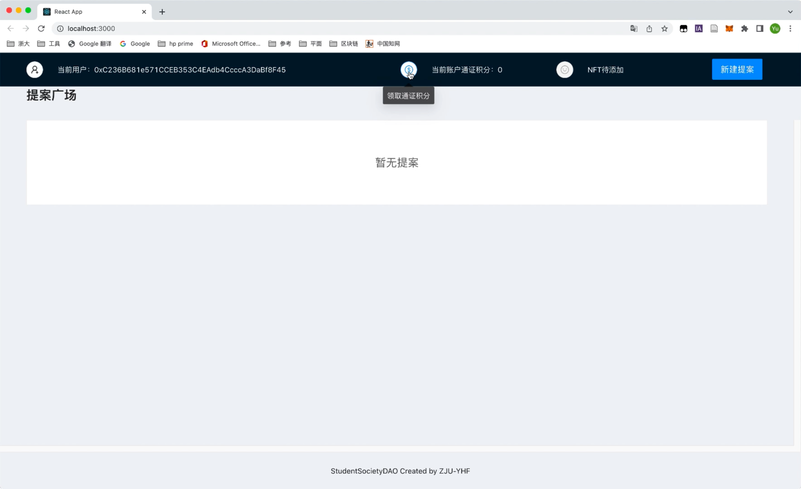
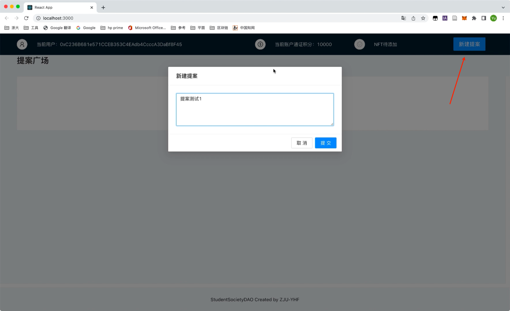
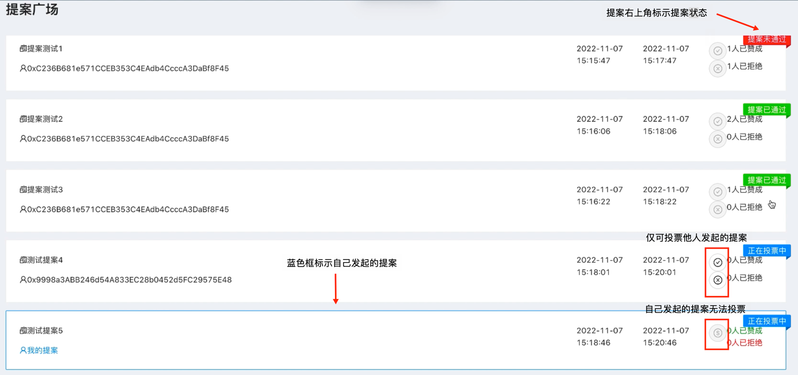
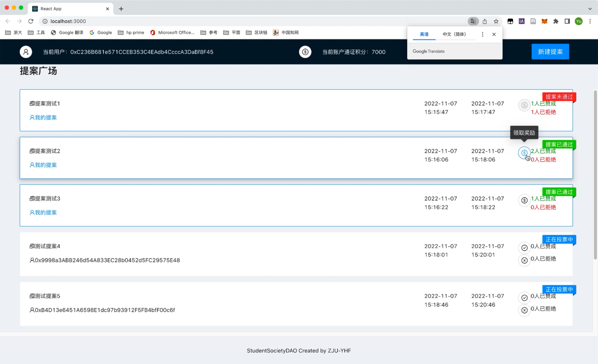
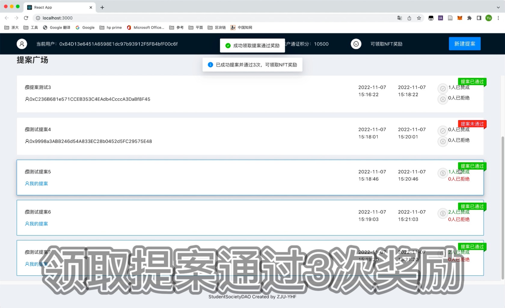
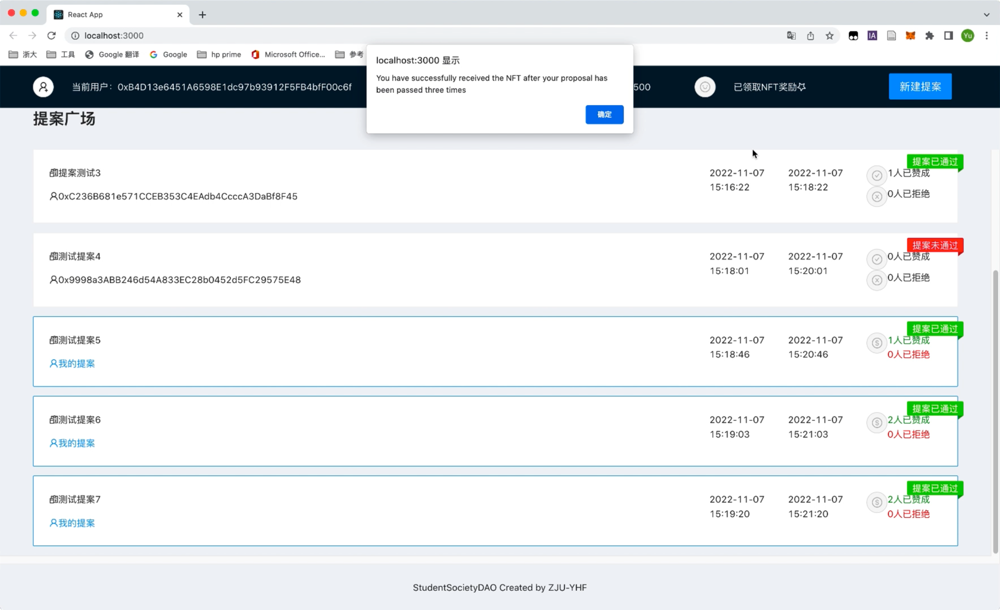

# ZJU-blockchain-course-yhf-3190104140

> 
> 
> 去中心化学生社团组织治理应用 
> 
> - 每个学生初始可以拥有或领取**10000通证积分**（ERC20）。 
> - 每个学生可以在应用中可以： 
>    1. 使用**1000通证积分**，发起关于该社团进行活动或制定规则的提案（Proposal）。 
>    2. 提案发起后一定支出时间内，使用**100通证积分**可以对提案进行投票（赞成或反对，限制投票次数），投票行为被记录到区块链上。 
>    3. 提案投票时间截止后，赞成数大于反对数的提案通过，提案发起者作为贡献者可以领取一定的积分奖励（**该提案上所投入的所有积分**）
> 
> - (Bonus）发起提案并通过3次的学生，可以领取社团颁发的纪念品（ERC721）


## 如何运行

1. 在本地启动ganache应用。

2. 在 `./contracts` 中安装需要的依赖，运行如下的命令：
    ```bash
    npm install
    ```
3. 在 `./contracts` 中编译合约，运行如下的命令：
    ```bash
    npx hardhat compile
    ```
4. 在 `./front` 中启动前端程序，运行如下的命令：
    ```bash
    npm run start
    ```
5. 页面左上角单击"连接钱包"按钮，弹出MetaMask窗口选择希望连接到该网站的账户；账户连接完成后，页面左上角显示用户地址。

6. 页面上方中部单击"领取通证积分"按钮，在MetaMask窗口中确认交易，完成首次通证积分领取（再次领取显示交易失败）；页面上方中部显示当前账户通证积分数量。

7. 拥有一定数量的通证积分（1000）时，可单击页面右上角"新建提案"按钮，输入提案内容后单击"提交"，并通过MetaMask窗口确认交易。

8. 提案广场中，当前账户发起的提案内容由蓝色框标示，每个提案右上角标示提案状态（正在投票中、提案已通过、提案未通过）。
   1. 对于他人发起的提案，每个用户可以单击"赞成"或"拒绝"按钮来发起对提案的投票。
   2. 对于自己发起的提案，提案进行过程中或提案结束但未通过时，交互按钮为不可选中状态；提案结束后，若提案已通过，则单击"领取奖励"按钮，可以领取该提案上所投入的所有积分。
   
9. 达到提案截止时间后，若赞成数**大于**反对数的提案通过。

10. 当用户发起的提案数大于等于3次时，提示可领取NFT奖励。



## 功能实现分析

1. 每个学生初始可以拥有或领取10000通证积分（ERC20）：通过ERC20函数完成，在领取后设置标志位来判断是否已完成首次领取。
```
    //用户领取初始通证积分
    function getIniToken() external {
        require(claimedTokenUserList[msg.sender] == false, "You have already received the token");
        _mint(msg.sender, 10000); //给msg.sender发10000钱
        claimedTokenUserList[msg.sender] = true;
    }
```
2. 使用1000通证积分，发起关于该社团进行活动或制定规则的提案（Proposal）：通过"addNewProposal"函数，为新建的提案设置内容并建立索引。
```
    //新建提案
    function addNewProposal(string calldata ProposalContent) public {
        require(UserToken.balanceOf(msg.sender) >= 1000, "You don't have enough token to initiate a proposal");//确认积分足够发起提案
        UserToken.transferFrom(msg.sender, address(this), 1000); //委托转账给本合约

        uint currentIndex = _AllProposals.ProposalCounter.current(); // 获取当前提案计数

        Proposal memory NewProposal = Proposal({
            index:currentIndex,
            proposer:msg.sender,
            content:ProposalContent,
            startTime:block.timestamp,
            endTime:block.timestamp+2*60,
            StatusProposal:0,
            numAgree:0,
            numDisagree:0,
            TokenPaid:false,
            TokenRecieved:false
        });

        _AllProposals.ProposalInfo[currentIndex] = NewProposal; // 添加一个提案
        _AllProposals.ProposalIndex.push(currentIndex); // 添加一个新id
        _AllProposals.ProposalCounter.increment(); //
    }
```
3. 提案发起后一定支出时间内，使用100通证积分可以对提案进行投票，投票行为被记录到区块链上：根据输入的投票类型，设置提案内的票数变量。 
```
    //投票
    function addNewVote(uint content, uint proposalIndex ) public {
        require(UserToken.balanceOf(msg.sender) >= 100, "You don't have enough token to vote");
        UserToken.transferFrom(msg.sender, address(this), 100); // 委托转账给本合约

        if (content == 1){_AllProposals.ProposalInfo[proposalIndex].numAgree++;}
        else if (content == 2){_AllProposals.ProposalInfo[proposalIndex].numDisagree++;}
    }
```
4. 提案投票时间截止后，赞成数大于反对数的提案通过，提案发起者作为贡献者可以领取一定的积分奖励（该提案上所投入的所有积分）：判断提案内的同意票数是否大于反对票数，若满足通过条件则在前端设置按钮可交互，使得用户可以通过单击按钮调用领取奖励的函数。
```
    // 统计提案投票情况
    function getProposalStatus(uint proposalIndex, uint256 nowTime) public view returns (uint) {
        if (nowTime > _AllProposals.ProposalInfo[proposalIndex].endTime) {
            if (_AllProposals.ProposalInfo[proposalIndex].numAgree > _AllProposals.ProposalInfo[proposalIndex].numDisagree) {return 1;}
            else{return 2;}
        }
        else {return 0;}
    }
```
```
    // 提案通过奖励
    function getProposalReward(uint proposalIndex) public {
        _AllProposals.ProposalInfo[proposalIndex].TokenPaid = true;
        UserToken.transfer(msg.sender,(_AllProposals.ProposalInfo[proposalIndex].numDisagree+_AllProposals.ProposalInfo[proposalIndex].numAgree)*100 +1000 );
    }
```
```
 <Tooltip
   title={Date.parse(new Date().toString()) / 1000 < itemproposalInfo.endTime ? "正在投票中" : (itemproposalInfo.TokenPaid == true ? "奖励已领取" : "领取奖励")}>
      <Button
         shape="circle"
         icon={<DollarCircleOutlined/>}
         disabled={itemproposalInfo.TokenPaid == true ? true : (itemproposalInfo.StatusProposal == 1 ? false : true)}
         onClick={() => getProposalReward(itemproposalInfo.index)}
      />
 </Tooltip>
```
5. 发起提案并通过3次的学生，可以领取社团颁发的纪念品（ERC721）：在前端判断用户发起提案的通过数量，满足条件后设置按钮可交互，使得用户可以通过单击按钮调用领取NFT奖励的函数。

```
<Tooltip title="领取NFT奖励">
   <Button
      shape="circle"
      icon={<SmileOutlined/>}
      disabled={userInfo.numPassedProposal >= 3 ? (userInfo.getNFT == false ? false : true) : true}
      onClick={() => getNFT()}
   />
</Tooltip>
```
```
    function awardItem(address player, string memory tokenURI) public returns (uint256)
    {
        uint256 newItemId = _tokenIds.current();

        _mint(player, newItemId);//发币
        _setTokenURI(newItemId, tokenURI);

        _tokenIds.increment();

        _AllUserNFT.UserNFTInfo[msg.sender].getNFT = true;
        _AllUserNFT.UserNFTInfo[msg.sender].NFTId = newItemId;
        _AllUserNFT.UserNFTInfo[msg.sender].NFTURI = tokenURI;

        return newItemId;
    }
```


## 参考内容

[0] [课程参考DEMOs](https://github.com/LBruyne/blockchain-course-demos)

[1] [IntelliJ IDEA2022.2.3 破解教程 ](http://blog.idejihuo.com/jetbrains/intellij-idea-2022-2-3-tutorial-permanently-activate-tutorial.html)

[2] [Solidity文档](https://docs.soliditylang.org/en/v0.8.17/)

[3] [Solidity - 算术运算的截断模式（unchecked）与检查模式（checked）- 0.8.0新特性](https://blog.csdn.net/ling1998/article/details/125550140)

[4] [openzeppelin文档](https://docs.openzeppelin.com/contracts/3.x/)

[5] [Mac终端使用技巧 切换到其他路径和目录](https://blog.csdn.net/robinson_911/article/details/53054104)

[6] [npm install 失败相关](https://blog.csdn.net/yqx_123/article/details/118787849)、[npm install 报错没有匹配版本：No matching version found for](https://blog.csdn.net/qq_27127385/article/details/104922311)

[7] [React文档](https://create-react-app.dev/docs/getting-started/)

[8] [React菜鸟教程](https://www.runoob.com/react/react-tutorial.html)

[9] [React+Material UI-From zero to hero](https://www.youtube.com/playlist?list=PLDxCaNaYIuUlG5ZqoQzFE27CUOoQvOqnQ)

[10] [ReactRouter文档](https://reactrouter.com/en/main/start/tutorial)

[11] [Hardhat - 警告合约代码超长解决方案](https://blog.csdn.net/ling1998/article/details/125158721)

[12] [Migrating from JavaScript](https://www.typescriptlang.org/docs/handbook/migrating-from-javascript.html)

[13] [React时间戳与日期格式转换](https://blog.csdn.net/weixin_39566210/article/details/118417477)

[14] [智能合约Stack Too Deep解决方法](https://www.jianshu.com/p/b3f7fdfce5f9)

[15] [ERC721文档](https://docs.openzeppelin.com/contracts/4.x/erc721)