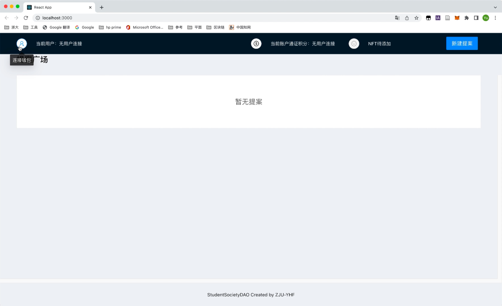

# ZJU-blockchain-course-yhf-3190104140

> 
> 
> 去中心化学生社团组织治理应用 
> 
> - 每个学生初始可以拥有或领取**10000通证积分**（ERC20）。 
> - 每个学生可以在应用中可以： 
>    1. 使用**1000通证积分**，发起关于该社团进行活动或制定规则的提案（Proposal）。 
>    2. 提案发起后一定支出时间内，使用**100通证积分**可以对提案进行投票（赞成或反对，限制投票次数），投票行为被记录到区块链上。 
>    3. 提案投票时间截止后，赞成数大于反对数的提案通过，提案发起者作为贡献者可以领取一定的积分奖励（**该提案上所投入的所有积分**）
> 
> - (Bonus）发起提案并通过3次的学生，可以领取社团颁发的纪念品（ERC721）


## 如何运行

1. 在本地启动ganache应用。

2. 在 `./contracts` 中安装需要的依赖，运行如下的命令：
    ```bash
    npm install
    ```
3. 在 `./contracts` 中编译合约，运行如下的命令：
    ```bash
    npx hardhat compile
    ```
4. 在 `./front` 中启动前端程序，运行如下的命令：
    ```bash
    npm run start
    ```
5. 页面左上角单击"连接钱包"按钮，弹出MetaMask窗口选择希望连接到该网站的账户；账户连接完成后，页面左上角显示用户地址。

6. 页面上方中部单击"领取通证积分"按钮，在MetaMask窗口中确认交易，完成首次通证积分领取（再次领取显示交易失败）；页面上方中部显示当前账户通证积分数量。
7. 拥有一定数量的通证积分（1000）时，可单击页面右上角"新建提案"按钮，输入提案内容后单击"提交"，并通过MetaMask窗口确认交易。
8. 提案广场中，当前账户发起的提案内容由蓝色框标示，每个提案右上角标示提案状态（正在投票中、提案已通过、提案未通过）。
   1. 对于他人发起的提案，每个用户可以单击"赞成"或"拒绝"按钮来发起对提案的投票。
   2. 对于自己发起的提案，提案进行过程中或提案结束但未通过时，交互按钮为不可选中状态；提案结束后，若提案已通过，则单击"领取奖励"按钮，可以领取该提案上所投入的所有积分。
9. 达到提案截止时间后，若赞成数**大于**反对数的提案通过。
10. 当用户发起的提案数大于等于3次时，提示可领取NFT奖励。

## 功能实现分析

简单描述：项目完成了要求的哪些功能？每个功能具体是如何实现的？

建议分点列出。

## 项目运行截图

放一些项目运行截图。

项目运行成功的关键页面和流程截图。主要包括操作流程以及和区块链交互的截图。

## 参考内容

[0] [课程参考DEMOs](https://github.com/LBruyne/blockchain-course-demos)

[1] [IntelliJ IDEA2022.2.3 破解教程 ](http://blog.idejihuo.com/jetbrains/intellij-idea-2022-2-3-tutorial-permanently-activate-tutorial.html)

[2] [Solidity文档](https://docs.soliditylang.org/en/v0.8.17/)

[3] [Solidity - 算术运算的截断模式（unchecked）与检查模式（checked）- 0.8.0新特性](https://blog.csdn.net/ling1998/article/details/125550140)

[4] [openzeppelin文档](https://docs.openzeppelin.com/contracts/3.x/)

[5] [Mac终端使用技巧 切换到其他路径和目录](https://blog.csdn.net/robinson_911/article/details/53054104)

[6] [npm install 失败相关](https://blog.csdn.net/yqx_123/article/details/118787849)、[npm install 报错没有匹配版本：No matching version found for](https://blog.csdn.net/qq_27127385/article/details/104922311)

[7] [React文档](https://create-react-app.dev/docs/getting-started/)

[8] [React菜鸟教程](https://www.runoob.com/react/react-tutorial.html)


[React+Material UI-From zero to hero](https://www.youtube.com/playlist?list=PLDxCaNaYIuUlG5ZqoQzFE27CUOoQvOqnQ)

[ReactRouter文档](https://reactrouter.com/en/main/start/tutorial)

[Hardhat - 警告合约代码超长解决方案](https://blog.csdn.net/ling1998/article/details/125158721)

[Migrating from JavaScript](https://www.typescriptlang.org/docs/handbook/migrating-from-javascript.html)

[React时间戳与日期格式转换](https://blog.csdn.net/weixin_39566210/article/details/118417477)

[智能合约Stack Too Deep解决方法](https://www.jianshu.com/p/b3f7fdfce5f9)

[ERC721文档](https://docs.openzeppelin.com/contracts/4.x/erc721)